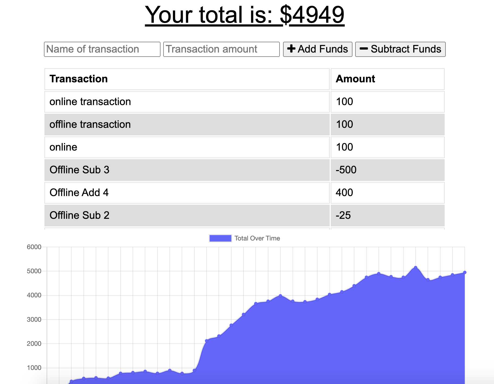

# Track-My-Budget-Online-Offline

 [Track-My-Budget-Online-Offline](#Track-My-Budget-Online-Offline)
    - [Table of Contents](#table-of-contents)
  * [Summary](#summary)
  * [Description](#description)
  * [Pre-requisite](#pre-requisite)
  * [Demo](#demo)
  * [Technologyused](#technologyused-)
  * [Install](#install-)
  * [Contributor](#contributor)
  * [Codebase](#codebase)
  * [Application Walk-through](#Application-walk-through)

## Summary
Add functionality to our existing Budget Tracker application to allow for offline access and functionality.

The user will be able to add expenses and deposits to their budget with or without a connection. When entering transactions offline, they should populate the total when brought back online. 
Offline Functionality:

  * Enter deposits offline

  * Enter expenses offline

When brought back online:

  * Offline entries should be added to tracker.

## Description
Giving users a fast and easy way to track their money is important, but allowing them to access that information anytime is even more important. Having offline functionality is paramount to our applications success.
GIVEN a user is on Budget App without an internet connection
WHEN the user inputs a withdrawal or deposit
THEN that will be shown on the page, and added to their transaction history when their connection is back online.

## Pre-requisite
Install NodeJS 

## Demo

## Technologyused:
<ul>
    <li> 
    <a href="https://developers.google.com/web/fundamentals/primers/service-workers" target="_blank">Service worker <a>
    <li> 
    <a href="https://developer.mozilla.org/en-US/docs/Web/Manifest" target="_blank"> Web App Manifest<a>
    </li>
    <li> 
    <a href="https://developer.mozilla.org/en-US/docs/Web/HTML/Using_the_application_cache" target="_blank">Saving in Cache </a>
    </li>
     <li> 
    <a href="https://developer.mozilla.org/en-US/docs/Web/API/IndexedDB_API" target="_blank">IndexDB storage </a>
    </li>
</ul>

## Install:
<strong>Code installation:</strong>  
$ cd [path_to_save_codebase]  
$ git clone https://github.com/arti-karnik/Track-My-Budget-Online-Offline 

<strong> Run the application: </strong>  
Open Terminal  
$ npm install  
$ npm start  
 
## Contributor
<strong> Github Profile: </strong>  
https://github.com/arti-karnik

<strong> Portfolio: </strong>  
https://arti-karnik.github.io/MyPortfolioPage/

## Codebase
https://github.com/arti-karnik/Track-My-Budget-Online-Offline

## Application Walk-through
<a href="https://fathomless-escarpment-54113.herokuapp.com/" target="_blank"> Click here for Application Live url </a>

